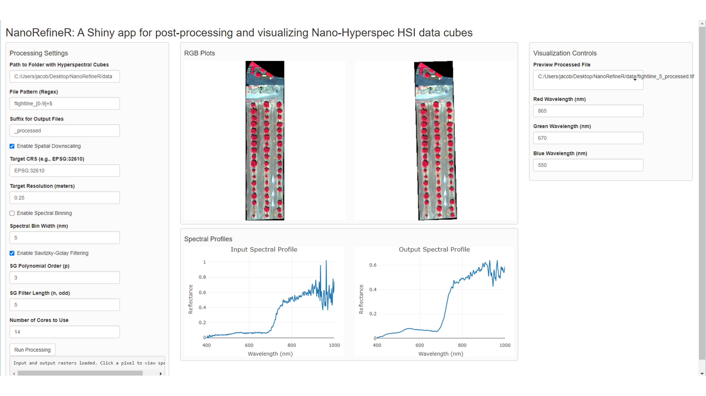

# NanoRefineR: A Shiny app for postprocessing and visualizing noisy Nano-Hyperspec HSI data cubes

NanoRefineR is a small project I developed to enable users to apply certain postprocessing techniques to noisy Headwall Nano-Hyperspec HSI cubes and visualize the spectral differences in real time. This tool allows users to rapidly determine which post-processing corrections they may want to make to HSI cubes and can also be used to post-process data in batch.

NanoRefineR provides two main functionalities:
- a post-processing component that allows for spatial downsampling, spectral binning, and Savitzky-Golay smoothing of input datasets
- a visualizer with control over band combinations and the ability to click on areas of an image and see the spectra. 

## Processing

## Visualization

